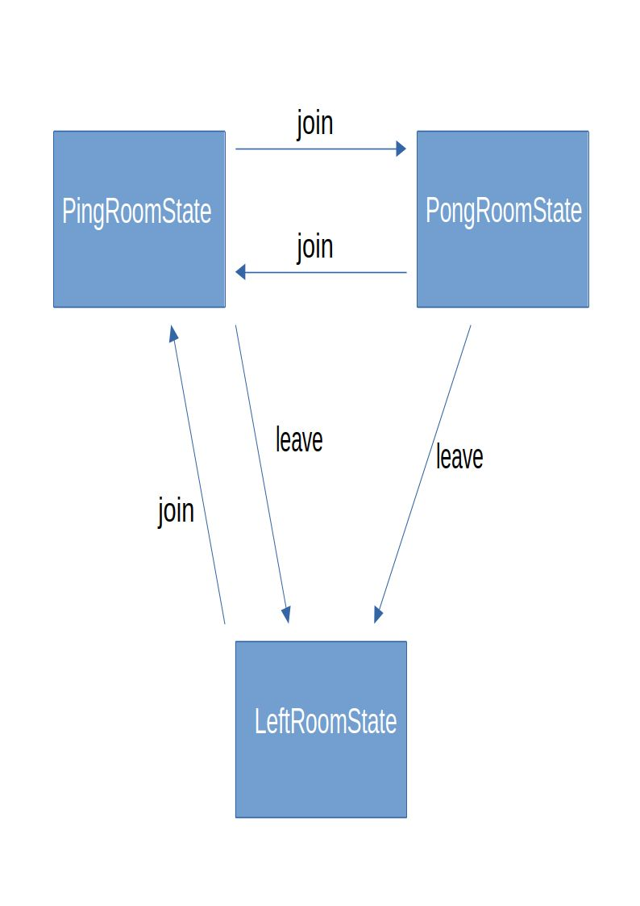
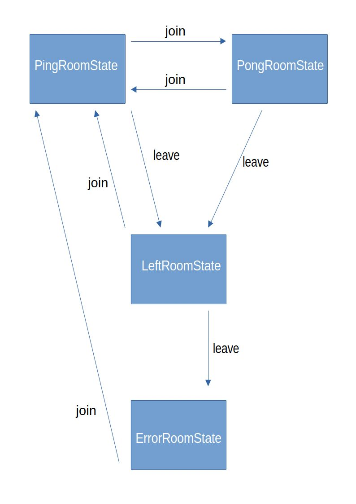

# React state design pattern

I write this article because I haven’t found solution that looks like mine, so my solution might be useful for someone else.

## Table of Content

- [React state design pattern](#react-state-design-pattern)
  - [Table of Content](#table-of-content)
  - [Implementation](#implementation)
    - [Implement the classes](#implement-the-classes)
    - [Use the state pattern in the react hook](#use-the-state-pattern-in-the-react-hook)
  - [The full code, so you can copy-paste](#the-full-code-so-you-can-copy-paste)
  - [Extended state machine (Error state, Copy-Pastable HTML)](#extended-state-machine-error-state-copy-pastable-html)
    - [Diagram](#diagram)
    - [Code](#code)
  - [What problems does it solve](#what-problems-does-it-solve)
  - [Why this article makes sense](#why-this-article-makes-sense)

## Implementation

We implement the state design pattern just like refactoring guru recommends: https://refactoring.guru/design-patterns/state

### Implement the classes

```js
class RoomState {
  #roomClient = null;
  #roomId = null;

  constructor(roomClient, roomId) {
    if (roomClient) {
      this.#roomClient = roomClient;
    }
    if (roomId) {
      this.roomId = roomId;
    }
  }

  set roomClient(roomClient) {
    if (roomClient) {
      this.#roomClient = roomClient;
    }
  }

  get roomClient() {
    return this.#roomClient;
  }

  set roomId(roomId) {
    if (roomId) {
      this.#roomId = roomId;
    }
  }

  get roomId() {
    return this.#roomId;
  }

  join(roomId) {
    throw new Error("Abstract method join(roomId).");
  }

  leave() {
    throw new Error("Abstract method leave().");
  }

  getStatusMessage() {
    throw new Error("Abstract method getStatusMessage().");
  }
}

// -------------------------------------------------------------------------

class PingRoomState extends RoomState {
  join(roomId) {
    this.roomClient.setState(new PongRoomState(this.roomClient, roomId));
  }

  leave() {
    const message = `Left Ping room ${this.roomId}`;
    this.roomClient.setState(new LeftRoomState(this.roomClient, message));
  }

  getStatusMessage() {
    return `In the Ping room ${this.roomId}`;
  }
}

// -------------------------------------------------------------------------

class PongRoomState extends RoomState {
  join(roomId) {
    this.roomClient.setState(new PingRoomState(this.roomClient, roomId));
  }

  leave() {
    const message = `Left Pong room ${this.roomId}`;
    this.roomClient.setState(new LeftRoomState(this.roomClient, message));
  }

  getStatusMessage() {
    return `In the Pong room ${this.roomId}`;
  }
}

// -------------------------------------------------------------------------

class LeftRoomState extends RoomState {
  #previousRoom = null;

  constructor(roomClient, previousRoom) {
    super(roomClient);
    this.#previousRoom = previousRoom;
  }

  join(roomId) {
    this.roomClient.setState(new PingRoomState(this.roomClient, roomId));
  }

  leave() {
    throw new Error(`Can't leave, no room assigned`);
  }

  getStatusMessage() {
    return `Not in any room (previously in ${this.#previousRoom})`;
  }
}
```

This is our state machine so far



### Use the state pattern in the react hook

The next problem, how do we use the classes in combination with react?

The other articles use useEffect and a string to store the name of the current state, we want to keep our implementation clean.

The roomClient can modify state, if it has a reference to setState function.

Problems:

- We can’t pass the setState if we initialize the state with the class.
- We don’t want to return null from the hook.
- We don’t want to return mock methods that return nothing from the hook.

Solution, provide the roomClient as soon as the state is initialized, right below the useState.

```js
function useRoomClient() {
  const [state, setState] = useState(new PingRoomState());

  // State contains the class
  // Initialize once
  // We can do this thanks to the `set` and `get` methods on
  // `roomClient` property
  if (!state.roomClient) {
    state.roomClient = { setState };
  }

  return state;
}
```

## The full code, so you can copy-paste

```js
class RoomState {
  #roomClient = null;
  #roomId = null;

  constructor(roomClient, roomId) {
    if (roomClient) {
      this.#roomClient = roomClient;
    }
    if (roomId) {
      this.roomId = roomId;
    }
  }

  set roomClient(roomClient) {
    if (roomClient) {
      this.#roomClient = roomClient;
    }
  }

  get roomClient() {
    return this.#roomClient;
  }

  set roomId(roomId) {
    if (roomId) {
      this.#roomId = roomId;
    }
  }

  get roomId() {
    return this.#roomId;
  }

  join(roomId) {
    throw new Error("Abstract method join(roomId).");
  }

  leave() {
    throw new Error("Abstract method leave().");
  }

  getStatusMessage() {
    throw new Error("Abstract method getStatusMessage().");
  }
}

// -------------------------------------------------------------------------

class PingRoomState extends RoomState {
  join(roomId) {
    this.roomClient.setState(new PongRoomState(this.roomClient, roomId));
  }

  leave() {
    const message = `Left Ping room ${this.roomId}`;
    this.roomClient.setState(new LeftRoomState(this.roomClient, message));
  }

  getStatusMessage() {
    return `In the Ping room ${this.roomId}`;
  }
}

// -------------------------------------------------------------------------

class PongRoomState extends RoomState {
  join(roomId) {
    this.roomClient.setState(new PingRoomState(this.roomClient, roomId));
  }

  leave() {
    const message = `Left Pong room ${this.roomId}`;
    this.roomClient.setState(new LeftRoomState(this.roomClient, message));
  }

  getStatusMessage() {
    return `In the Pong room ${this.roomId}`;
  }
}

// -------------------------------------------------------------------------

class LeftRoomState extends RoomState {
  #previousRoom = null;

  constructor(roomClient, previousRoom) {
    super(roomClient);
    this.#previousRoom = previousRoom;
  }

  join(roomId) {
    this.roomClient.setState(new PingRoomState(this.roomClient, roomId));
  }

  leave() {
    throw new Error(`Can't leave, no room assigned`);
  }

  getStatusMessage() {
    return `Not in any room (previously in ${this.#previousRoom})`;
  }
}

function useRoomClient() {
  const [state, setState] = useState(new PingRoomState());

  // State contains the class
  // Initialize once
  // We can do this thanks to the `set` and `get` methods on
  // `roomClient` property
  if (!state.roomClient) {
    state.roomClient = { setState };
  }

  return state;
}
```

## Extended state machine (Error state, Copy-Pastable HTML)

We externd the state machine, because we want to transition to Error state if we try to leave the room and it results in erroneous operation. It allows us to display status message by calling getStatusMessage.

### Diagram



### Code

```html
<!DOCTYPE html>
<html lang="en">
  <head>
    <meta charset="UTF-8" />
    <meta name="viewport" content="width=device-width, initial-scale=1.0" />
    <title>Document</title>
  </head>
  <body>
    <div id="root"></div>

    <script src="https://cdn.jsdelivr.net/npm/react@18.3.1/umd/react.development.js"></script>
    <script src="https://cdn.jsdelivr.net/npm/react-dom@18.3.1/umd/react-dom.development.js"></script>
    <script>
      class RoomState {
        #roomClient = null;
        #roomId = null;

        constructor(roomClient, roomId) {
          if (roomClient) {
            this.#roomClient = roomClient;
          }
          if (roomId) {
            this.roomId = roomId;
          }
        }

        set roomClient(roomClient) {
          if (roomClient) {
            this.#roomClient = roomClient;
          }
        }

        get roomClient() {
          return this.#roomClient;
        }

        set roomId(roomId) {
          if (roomId) {
            this.#roomId = roomId;
          }
        }

        get roomId() {
          return this.#roomId;
        }

        join(roomId) {
          throw new Error("Abstract method join(roomId).");
        }

        leave() {
          throw new Error("Abstract method leave().");
        }

        getStatusMessage() {
          throw new Error("Abstract method getStatusMessage().");
        }
      }

      // -------------------------------------------------------------------------

      class PingRoomState extends RoomState {
        join(roomId) {
          this.roomClient.setState(new PongRoomState(this.roomClient, roomId));
        }

        leave() {
          const message = `Left Ping room ${this.roomId}`;
          this.roomClient.setState(new LeftRoomState(this.roomClient, message));
        }

        getStatusMessage() {
          return `In the Ping room ${this.roomId}`;
        }
      }

      // -------------------------------------------------------------------------

      class PongRoomState extends RoomState {
        join(roomId) {
          this.roomClient.setState(new PingRoomState(this.roomClient, roomId));
        }

        leave() {
          const message = `Left Pong room ${this.roomId}`;
          this.roomClient.setState(new LeftRoomState(this.roomClient, message));
        }

        getStatusMessage() {
          return `In the Pong room ${this.roomId}`;
        }
      }

      // -------------------------------------------------------------------------

      class LeftRoomState extends RoomState {
        #previousRoom = null;

        constructor(roomClient, previousRoom) {
          super(roomClient);
          this.#previousRoom = previousRoom;
        }

        join(roomId) {
          this.roomClient.setState(new PingRoomState(this.roomClient, roomId));
        }

        leave() {
          // Extend to shift to error state
          this.roomClient.setState(
            new ErrorRoomState(
              this.roomClient,
              new Error(`Can't leave, no room assigned`)
            )
          );
        }

        getStatusMessage() {
          return `Not in any room (previously in ${this.#previousRoom})`;
        }
      }

      // Extend our state machine to hold one more state.
      class ErrorRoomState extends RoomState {
        #error = null;

        constructor(roomClient, error) {
          super(roomClient);
          this.#error = error;
        }

        join(roomId) {
          this.roomClient.setState(new PingRoomState(this.roomClient, roomId));
        }

        leave() {
          // Do nothing... We can't move anywhere. We handled error.
        }

        getStatusMessage() {
          return `An error occurred. ${this.#error.message}`;
        }
      }

      const { useState } = React;

      function useRoomClient() {
        const [state, setState] = useState(new PingRoomState());

        // State contains the class
        // Initialize once
        // We can do this thanks to the `set` and `get` methods on
        // `roomClient` property
        if (!state.roomClient) {
          state.roomClient = { setState };
        }

        return state;
      }

      // ----------------------------------------------------------------------
      // Usage example
      // ----------------------------------------------------------------------

      const e = React.createElement;

      function useWithError(obj) {}

      function App() {
        const roomClient = useRoomClient();

        return e(
          "div",
          null,
          e("h1", null, "Change room state"),
          e("p", null, `Status message: ${roomClient.getStatusMessage()}`),
          e(
            "div",
            null,
            e("button", { onClick: () => roomClient.join("a") }, "Join"),
            e("button", { onClick: () => roomClient.leave() }, "Leave")
          )
        );
      }

      const { createRoot } = ReactDOM;
      const root = document.getElementById("root");
      createRoot(root).render(React.createElement(App));
    </script>
  </body>
</html>
```

## What problems does it solve

- We can scale the state machine without modifying existing code.

- Less bugs.

- More understandable code, once we grasp how it works (All we have to do is add a new class for a new state).

- Avoid complicated if-else blocks, complex state mutations, one switch statement

- Is nice if you want to create real time rooms using WebSockets (We can monitor user room connection state, and other types of states).

## Why this article makes sense

When I searched for state design pattern on Google, these were my first results

Links to the 3 results:

https://refactoring.guru/design-patterns/state

https://en.wikipedia.org/wiki/State_pattern

https://www.geeksforgeeks.org/state-design-pattern/

https://medium.com/@udaykale/evolving-the-state-design-pattern-e6682a866fdd

Searching react state design pattern gives implementations that look nothing like the implementation on https://refactoring.guru/design-patterns/state

Links to the results from the search:

https://medium.com/@yah.emam/state-design-pattern-using-react-hooks-c535e1daa6f1

https://blog.logrocket.com/modern-guide-react-state-patterns/

https://github.com/themithy/react-design-patterns/blob/master/doc/state-pattern.md

https://refine.dev/blog/react-design-patterns/

https://react.dev/learn/choosing-the-state-structure
